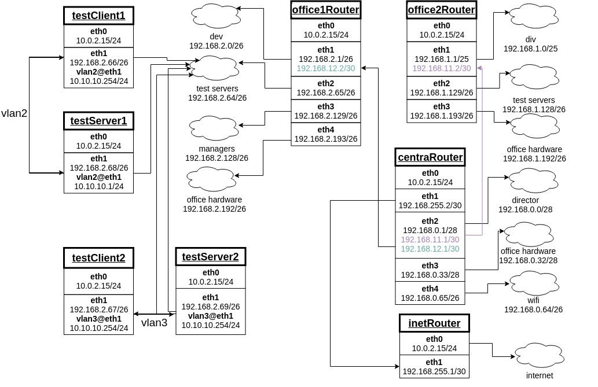

Домашнее задание
разворачиваем сетевую лабораторию

 Дано 
 

строим бонды и вланы
в Office1 в тестовой подсети появляется сервера с доп интерфесами и адресами
во internal сети testLAN
- testClient1 - 10.10.10.254
- testClient2 - 10.10.10.254
- testServer1- 10.10.10.1 
- testServer2- 10.10.10.1

равести вланами
testClient1 <-> testServer1
testClient2 <-> testServer2

между centralRouter и inetRouter
"пробросить" 2 линка (общая inernal сеть) и объединить их в бонд актив-актив
проверить работу если выборать интерфейсы в бонде по очереди

______________________________________________________
# Выполнение

тестовые сервера поделил на 2 группы:

1) **testClient1 - testServer1** (vlan создан с помощью конфигурационных файлов) 
2) **testClient2 - testServer2** (vlan создан с помощью nmcli)

С bondами решил поступить похожим образом.
на **centralRouter** бонд собран из двух интерфейсов создан с помощью nmcli.
на **inetRouter** бонд собран из двух интерфейсов создан с помощью файла конфигурации.

Добавлена авторизация по сертификату между серверами. Сертификаты берутся из папки **ssh**.

######

# Домашнее задание выполнено
