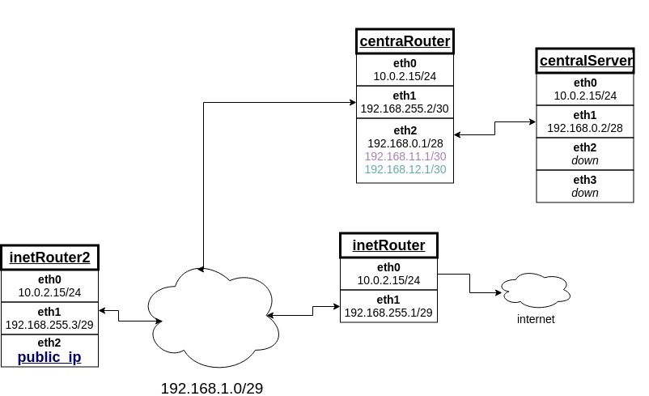

Домашнее задание
разворачиваем сетевую лабораторию
<details>
<summary> Дано </summary> 
  
# otus-linux

Сценарии iptables
1) реализовать knocking port
- centralRouter может попасть на ssh inetrRouter через knock скрипт
пример в материалах
2) добавить inetRouter2, который виден(маршрутизируется) с хоста
3) запустить nginx на centralServer
4) пробросить 80й порт на inetRouter2 8080
5) дефолт в инет оставить через inetRouter

</details>

______________________________________________________
# Выполнение


______________________________________________________

Добавил inetRouter2 с публичным интерфейсом.
На centralServer поднят *nginx* с дефолтной конфигурацией. 
Для того что бы *nginx* был виден нам с хоста на котором поднят стенд, необходимо с помощью iptables пробросить **80** порт сначала на **centralRouter**, а с него на centralServer.


### Настройка iptables на inetRouter2

Пробрасываем 80 порт с интерфейса **eth2** - inetRouter2 на **eth1** - centralRouter:

``````
iptables -t nat -A PREROUTING -p tcp -i eth2 --dport 80 -j DNAT --to-destination 192.168.255.2 
``````

Так же необходимо изменить адресс источника, который обращается к хосту. Иначе nginx на centralServer не *узнает* куда *ответить*. Для этого пропишем команду, которая подменит адресс источника который обращается на 80 порт, на адрес inetRouter2

``````
iptables -t nat -A POSTROUTING -p --dst 192.168.255.2 --dport 80 -j SNAT --to-source 192.168.255.3 
``````

### Настройка iptables на centralRouter

Т.к. centralServer видит inetRouter2, нам остается только прокинуть 80 порт c адресса 192.168.255.2 на 192.168.0.2.

``````
iptables -t nat -A PREROUTING -p tcp -d 192.168.255.2 --dport 80 -j DNAT --to-destination 192.168.0.2
``````

После этого с хоста на котором поднят стенд мы сможем обращаться к **nginx'y** который находится на centralServer по ip адресу который получил inetRouter2 на сетевом интерфейсе eth2.

______________________________________________________

### knocking port

Честно говоря, делал по мануалу с [digital ocean](https://www.digitalocean.com/community/tutorials/how-to-configure-port-knocking-using-only-iptables-on-an-ubuntu-vps).

А именно не совсем понял, что происходит с от флага *-m recent --name AUTH1*. Остальное могу даже объяснить)

<details>
<summary> Настраиваем portKnocking средствами iptables </summary> 


`````
iptables -N KNOCKING
iptables -N GATE1
iptables -N GATE2
iptables -N GATE3
iptables -N PASSED

sudo iptables -A INPUT -m conntrack --ctstate ESTABLISHED,RELATED -j ACCEPT
sudo iptables -A INPUT -i lo -j ACCEPT
sudo iptables -A INPUT -i eth0 -j ACCEPT
sudo iptables -A INPUT -j KNOCKING
sudo iptables -A GATE1 -p tcp --dport 1111 -m recent --name AUTH1 --set -j DROP
sudo iptables -A GATE1 -j DROP
sudo iptables -A GATE2 -m recent --name AUTH1 --remove
sudo iptables -A GATE2 -p tcp --dport 2222 -m recent --name AUTH2 --set -j DROP
sudo iptables -A GATE2 -j GATE1
sudo iptables -A GATE3 -m recent --name AUTH2 --remove
sudo iptables -A GATE3 -p tcp --dport 2222 -m recent --name AUTH3 --set -j DROP
sudo iptables -A GATE3 -j GATE1
sudo iptables -A PASSED -m recent --name AUTH3 --remove
sudo iptables -A PASSED -p tcp --dport 22 -j ACCEPT
sudo iptables -A PASSED -j GATE1
sudo iptables -A KNOCKING -m recent --rcheck --seconds 30 --name AUTH3 -j PASSED
sudo iptables -A KNOCKING -m recent --rcheck --seconds 10 --name AUTH2 -j GATE3
sudo iptables -A KNOCKING -m recent --rcheck --seconds 10 --name AUTH1 -j GATE2
sudo iptables -A KNOCKING -j GATE1
`````

</details>

_______________________________________________

### Как проверить.
После того как выполним vagrant up. Необходимо посмотреть какой ip адрес получил inetRouter2 на **eth2**. На нем будет виден *nginx* с centralServer.

Для проверки knocking port, на centralRouter в домашней папке пользователя **vagrant** лежит скрипт **knock_client.sh** для *простукивания* нужных портов с последующей авторизаций на inetRouter. 