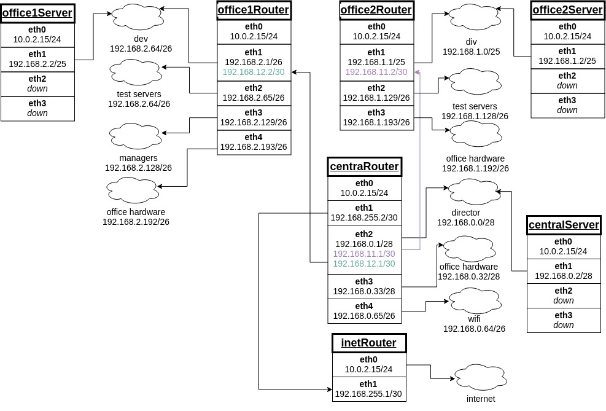

Домашнее задание
разворачиваем сетевую лабораторию

# otus-linux
Vagrantfile - для стенда урока 9 - Network

# Дано
https://github.com/erlong15/otus-linux/tree/network

(ветка network)

Vagrantfile с начальным построением сети
- inetRouter
- centralRouter
- centralServer

тестировалось на virtualbox

# Планируемая архитектура
построить следующую архитектуру

Сеть office1
- 192.168.2.0/26 - dev
- 192.168.2.64/26 - test servers
- 192.168.2.128/26 - managers
- 192.168.2.192/26 - office hardware

Сеть office2
- 192.168.1.0/25 - dev
- 192.168.1.128/26 - test servers
- 192.168.1.192/26 - office hardware


Сеть central
- 192.168.0.0/28 - directors
- 192.168.0.32/28 - office hardware
- 192.168.0.64/26 - wifi

```
Office1 ---\
-----> Central --IRouter --> internet
Office2----/
```
Итого должны получится следующие сервера
- inetRouter
- centralRouter
- office1Router
- office2Router
- centralServer
- office1Server
- office2Server

# Теоретическая часть
- Найти свободные подсети
- Посчитать сколько узлов в каждой подсети, включая свободные
- Указать broadcast адрес для каждой подсети
- проверить нет ли ошибок при разбиении

# Практическая часть
- Соединить офисы в сеть согласно схеме и настроить роутинг
- Все сервера и роутеры должны ходить в инет черз inetRouter
- Все сервера должны видеть друг друга
- у всех новых серверов отключить дефолт на нат (eth0), который вагрант поднимает для связи
- при нехватке сетевых интервейсов добавить по несколько адресов на интерфейс

______________________________________________________
# Выполнение

# Теоретическая часть

______________________________________________________
**Сеть office1:**

**192.168.2.0/26 - dev:**
- Всего узлов: 62
- Broadcast Address: 192.168.2.63

**192.168.2.64/26 - test servers:**
- Всего узлов: 62
- Broadcast Addres: 192.168.2.127

**192.168.2.128/26 - managers:**
- Всего узлов: 62
- Broadcast Addres: 192.168.2.191

**192.168.2.192/26 - office hardware:**
- Всего узлов: 62
- Broadcast Addres: 192.168.2.254
______________________________________________________
**Сеть office2:**

**192.168.1.0/25 - dev:**
- Всего узлов: 126
- Broadcast Address: 192.168.1.127

**192.168.1.128/26 - test servers:**
- Всего узлов: 62
- Broadcast Addres: 192.168.1.191

**192.168.1.192/26 - office hardware:**
- Всего узлов: 62
- Broadcast Addres: 192.168.1.254
______________________________________________________
**Сеть Central:**

**192.168.0.0/28 - director:**
- Всего узлов: 14 
- Broadcast Address: 192.168.0.15

**192.168.0.32/28 - test servers:**
- Всего узлов: 14
- Broadcast Addres: 192.168.1.47

**192.168.1.64/26 - office hardware:**
- Всего узлов: 62
- Broadcast Addres: 192.168.1.127
______________________________________________________

Свободные подсети имеются только в сети Central: 
- 192.168.0.16/28
- 192.168.0.48/28
- 192.168.0.128/25
___________________________________________________________________

# Практическая часть

______________________________________________________
Подсмотрел у коллег как можно отрисовать схему, мне понравилось. 




